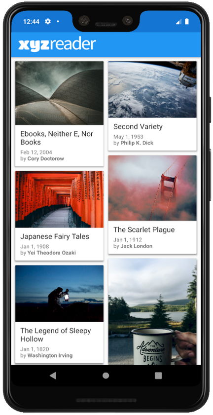
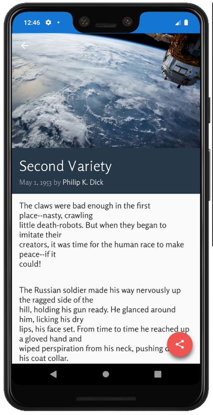

# XYZ Reader

In Project 6 of the Udacity Android Developer Nanodegree Program, **XYZ Reader** was developed in order to test: 

* Understanding of Android design fundamentals.
* Applying Material Design guidelines to a mobile application.
* Separating an interface into surfaces.
* Effectively using transitions and motion.

## Screenshots
 
 
